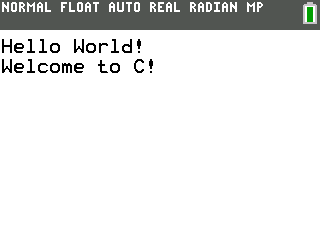

# Real-time clock demo

This is a simple demo that converts the current time to a unix timestamp.

Be sure to either set your calculator to UTC, or set it to your local time zone and compensate for it on `timezone_compensation` in the source code [here](https://github.com/ohnx/cestuff/blob/master/rtc/src/main.c#L43).

This demo requires the installation of the [C SDK Toolchain for use on the CE](https://github.com/CE-Programming/toolchain).
